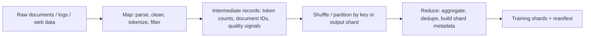

# Week 1 Day 3 - MapReduce And AI Training Data Pipelines

Today should teach one real idea:

MapReduce is not just an old batch-processing system. It is a clean mental model for large AI data pipelines: split a huge dataset into independent tasks, schedule those tasks near data, retry failed work, handle slow workers, and produce deterministic output shards.

## 60-Minute Plan

### 0-5 minutes - Write the objective

Open:

`notes/week_01/day_03_mapreduce_training_pipeline.md`

Write:

```markdown
Objective: explain how MapReduce handles task scheduling, failures, stragglers, data locality, and output partitioning, then map those ideas to a large-scale AI training data pipeline.
```

### 5-15 minutes - Read the official MIT assignment context

Read:

- MIT 6.5840 schedule: https://pdos.csail.mit.edu/6.824/schedule.html
- MIT 6.5840 Lab 1: MapReduce: https://pdos.csail.mit.edu/6.824/labs/lab-mr.html

Do not do the lab today. Skim only enough to notice:

- MIT uses MapReduce as the first hands-on distributed-systems lab.
- The coordinator/master assigns map and reduce tasks.
- Workers execute tasks and report completion.
- Correctness depends on retrying failed tasks and producing deterministic output.

Write down:

```markdown
MIT Lab 1 first impression:
- Coordinator owns:
- Worker owns:
- What can fail:
- Why this looks like AI data pipeline infrastructure:
```

### 15-35 minutes - Read the MapReduce paper selectively

Read:

- MapReduce paper: https://pdos.csail.mit.edu/6.824/papers/mapreduce.pdf

Read these sections only:

- Abstract
- 1 Introduction
- 2 Programming Model
- 3 Implementation
- 3.1 Execution Overview
- 3.3 Fault Tolerance
- 3.4 Locality
- 3.5 Task Granularity
- 3.6 Backup Tasks

Do not try to understand every implementation detail. Extract these ideas:

- `map` transforms input records into intermediate key/value pairs.
- `reduce` merges all intermediate values for the same key.
- A master/coordinator tracks task state and assigns work.
- Failed tasks can be re-executed.
- Slow tasks are not necessarily failed; they can be stragglers.
- Backup tasks/speculative execution can reduce the impact of stragglers.
- Data locality matters because network transfer is expensive.
- Many smaller tasks improve load balancing, but too many tasks create scheduling overhead.

### 35-50 minutes - Build the artifact

Fill:

`notes/week_01/day_03_mapreduce_training_pipeline.md`

First, fill the concept table:

```markdown
## MapReduce Concept Map

| MapReduce concept | What the paper means | AI training data pipeline analogy | Confidence |
| --- | --- | --- | --- |
| Input split |  |  |  |
| Map task |  |  |  |
| Intermediate key/value |  |  |  |
| Reduce task |  |  |  |
| Master/coordinator |  |  |  |
| Worker |  |  |  |
| Failed task |  |  |  |
| Straggler |  |  |  |
| Backup task |  |  |  |
| Data locality |  |  |  |
```

Then sketch a MapReduce-style AI data pipeline:



Then fill this design table:

```markdown
## AI Training Data Pipeline Sketch

| Stage | What it does | Failure/retry behavior | Bottleneck to watch |
| --- | --- | --- | --- |
| Input discovery |  |  |  |
| Map: parse/filter/tokenize |  |  |  |
| Shuffle/partition |  |  |  |
| Reduce: aggregate/dedupe/shard |  |  |  |
| Output manifest |  |  |  |
```

### 50-60 minutes - Answer checkpoint questions

Write answers in:

`checkpoints/week_01_day_03.md`

#### A. Source-grounded questions from the MapReduce paper

1. What do the `map` and `reduce` functions do?
2. What does the master/coordinator track?
3. How does MapReduce handle worker failure?
4. Why is a straggler different from a failed task?
5. Why does data locality matter?
6. Why can backup tasks reduce job completion time?
7. What tradeoff exists in choosing the number of map and reduce tasks?

#### B. Artifact-grounded questions from your pipeline sketch

8. In your AI training data pipeline sketch, what is the map stage?
9. In your AI training data pipeline sketch, what is the reduce stage?
10. Which stage is most likely to become a bottleneck, and what metric would you watch first?

## Expected Output

By the end of the hour, you should have:

- `notes/week_01/day_03_mapreduce_training_pipeline.md`
- `checkpoints/week_01_day_03.md`
- A filled MapReduce concept map
- A MapReduce-style AI training data pipeline sketch
- Answers to 7 source-grounded questions and 3 artifact-grounded questions

This is a good Day 3 if you can explain this sentence in your own words:

"A straggler is not necessarily broken; it is a task that is still running but slow enough to delay the whole distributed job."
