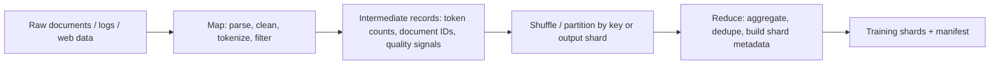

# Week 1 Day 3 - MapReduce And AI Training Data Pipelines

Objective: explain how MapReduce handles task scheduling, failures, stragglers, data locality, and output partitioning, then map those ideas to a large-scale AI training data pipeline.

## Sources

- MIT 6.5840 schedule: https://pdos.csail.mit.edu/6.824/schedule.html
- MIT 6.5840 Lab 1: MapReduce: https://pdos.csail.mit.edu/6.824/labs/lab-mr.html
- MapReduce paper: https://pdos.csail.mit.edu/6.824/papers/mapreduce.pdf

## Reading Notes

MIT Lab 1 first impression:

- Coordinator owns:
- Worker owns:
- What can fail:
- Why this looks like AI data pipeline infrastructure:

MapReduce paper notes:

- Map:
- Reduce:
- Master/coordinator:
- Worker failure:
- Straggler:
- Backup task:
- Data locality:
- Task granularity:

## MapReduce Concept Map

| MapReduce concept | What the paper means | AI training data pipeline analogy | Confidence |
| --- | --- | --- | --- |
| Input split |  |  |  |
| Map task |  |  |  |
| Intermediate key/value |  |  |  |
| Reduce task |  |  |  |
| Master/coordinator |  |  |  |
| Worker |  |  |  |
| Failed task |  |  |  |
| Straggler |  |  |  |
| Backup task |  |  |  |
| Data locality |  |  |  |

## MapReduce-Style AI Training Data Pipeline

## AI Training Data Pipeline Sketch

| Stage | What it does | Failure/retry behavior | Bottleneck to watch |
| --- | --- | --- | --- |
| Input discovery |  |  |  |
| Map: parse/filter/tokenize |  |  |  |
| Shuffle/partition |  |  |  |
| Reduce: aggregate/dedupe/shard |  |  |  |
| Output manifest |  |  |  |

## Open Questions

- 
