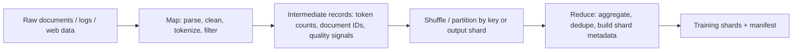

# Week 1 Day 3 - MapReduce And AI Training Data Pipelines

Objective: explain how MapReduce handles task scheduling, failures, stragglers, data locality, and output partitioning, then map those ideas to a large-scale AI training data pipeline.

## Sources

- MIT 6.5840 schedule: https://pdos.csail.mit.edu/6.824/schedule.html
- MIT 6.5840 Lab 1: MapReduce: https://pdos.csail.mit.edu/6.824/labs/lab-mr.html
- MapReduce paper: https://pdos.csail.mit.edu/6.824/papers/mapreduce.pdf

## Reading Notes

MIT Lab 1 first impression:

- Coordinator owns: assigning map/reduce work, tracking task state, handling worker timeouts, and deciding when the whole job is complete.
- Worker owns: executing one assigned task, reading input or intermediate data, writing output, and reporting completion.
- What can fail: workers can crash, hang, become unreachable, or produce temporary outputs that the coordinator must ignore/retry.
- Why this looks like AI data pipeline infrastructure: large training datasets also need task scheduling, retries, deterministic output shards, and progress tracking across many machines.

MapReduce paper notes:

- Map: user code processes input key/value pairs and emits intermediate key/value pairs.
- Reduce: user code receives one intermediate key and all values for that key, then merges them into output values.
- Master/coordinator: assigns M map tasks and R reduce tasks, tracks task state, records intermediate-output locations, and forwards those locations to reduce workers.
- Worker failure: the master periodically pings workers; if a worker does not respond, its in-progress tasks are reset to idle and completed map tasks are re-executed because their local intermediate output may be unavailable.
- Straggler: a task that has not failed but runs unusually slowly, often delaying the final completion of the whole job.
- Backup task: near the end of a job, the master may start duplicate executions of remaining in-progress tasks; whichever execution finishes first completes the task.
- Data locality: the master tries to schedule map tasks on or near machines that already store the input split, reducing network transfer.
- Task granularity: many tasks improve load balancing and recovery, but too many tasks increase master scheduling overhead and metadata.

## MapReduce Concept Map

| MapReduce concept | What the paper means | AI training data pipeline analogy | Confidence |
| --- | --- | --- | --- |
| Input split | A piece of the input data assigned to one map task; the paper describes splitting input files into M pieces that can be processed in parallel. | One shard or range of raw documents/logs/web pages assigned to a preprocessing worker. | High |
| Map task | A worker reads one input split, parses records, and applies the user-defined map function to produce intermediate key/value pairs. | Parse documents, clean text, tokenize, filter low-quality records, and emit metadata such as document ID, token count, language, or domain. | High |
| Intermediate key/value | The map output that is buffered, partitioned by reduce task, and later fetched by reduce workers. | Records such as `(domain, doc_id)`, `(hash, doc_id)`, `(language, token_count)`, or `(output_shard, tokenized_document)`. | High |
| Reduce task | A worker gathers all intermediate values for its partition/key range, sorts/groups them by key, and applies the reduce function. | Aggregate quality signals, deduplicate by content hash, group examples into output shards, and build shard-level metadata. | High |
| Master/coordinator | The special process that assigns tasks, tracks task state, stores intermediate-output locations, and tells reduce workers where to fetch map outputs. | A workflow orchestrator such as Airflow, Ray, Spark driver, or custom pipeline controller that tracks preprocessing jobs and output locations. | High |
| Worker | A process or machine that receives a map or reduce task from the master and executes it. | A CPU worker pod or batch job that preprocesses dataset shards or performs dedupe/shard-building work. | High |
| Failed task | A task whose worker failed or stopped responding; in-progress work is reset to idle, and completed map work on that worker may be re-executed because local output is lost. | A preprocessing pod dies after writing temporary files, so the pipeline reruns that shard instead of trusting partial output. | High |
| Straggler | A task that is still running but unusually slow, often delaying the last part of the job. | One tokenization shard runs much slower because of bad input, slow disk, noisy neighbor CPU load, or a skewed partition. | High |
| Backup task | A duplicate execution of a remaining in-progress task launched near job completion; the first copy to finish wins. | Start a duplicate preprocessing attempt for a slow shard so the dataset build is not blocked by one slow worker. | High |
| Data locality | Scheduling map tasks on or near machines that already store the input data to save scarce network bandwidth. | Run preprocessing near object-storage cache/local disk/data node to avoid repeatedly pulling terabytes across the network. | High |

## MapReduce-Style AI Training Data Pipeline

## AI Training Data Pipeline Sketch

| Stage | What it does | Failure/retry behavior | Bottleneck to watch |
| --- | --- | --- | --- |
| Input discovery | List raw files, assign stable input splits, record file sizes/checksums, and create the work queue. | If discovery fails, rerun from the last complete listing; keep split IDs deterministic so retries do not duplicate data. | Metadata/listing latency, object-store API rate limits, and total bytes discovered. |
| Map: parse/filter/tokenize | Read each split, parse records, clean text, run filters, tokenize, and emit intermediate records. | Retry failed splits from the original input; write temporary outputs and only commit after the split succeeds. | MB/sec per worker, tokens/sec, bad-record count, CPU utilization, and slowest split duration. |
| Shuffle/partition | Partition intermediate records by key or target output shard so related records go to the same reduce task. | If a map output is lost, rerun the map task; if a transfer fails, retry the fetch from a valid committed output. | Network bytes, skewed partitions, shuffle spill size, and time spent waiting for remote reads. |
| Reduce: aggregate/dedupe/shard | Group records, aggregate quality statistics, dedupe by hash or document ID, and write training shard contents. | Retry reduce tasks using committed intermediate map outputs; use atomic final writes so partial shards are ignored. | Largest partition size, dedupe memory, external sort/spill time, and output write throughput. |
| Output manifest | Record final shard paths, checksums, counts, token totals, schema version, and preprocessing config. | Regenerate or validate the manifest from committed shards; never publish the dataset until manifest validation passes. | Manifest correctness, missing shard count, checksum mismatch count, and publish latency. |

## Open Questions

- How should a modern LLM data pipeline handle records that deterministically crash tokenization: skip with audit logs, quarantine for review, or fail the build?
